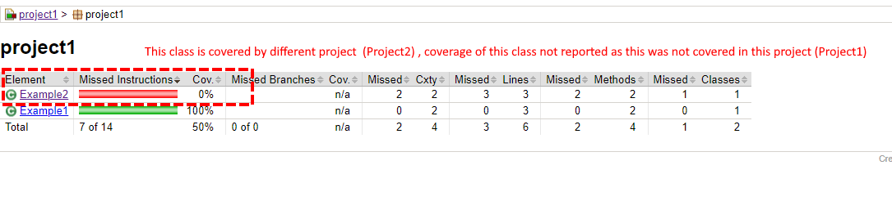
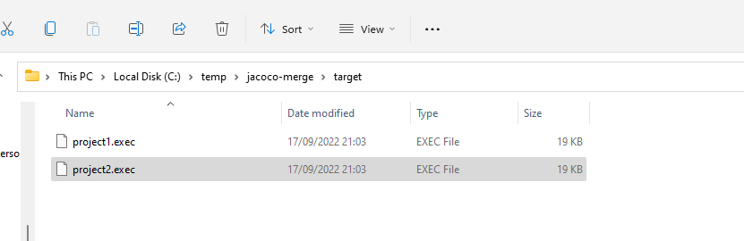
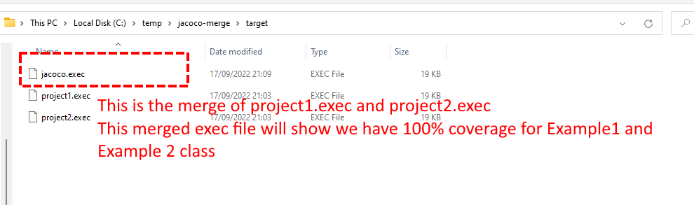
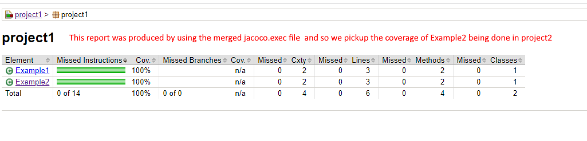

Example project to show jacoco:merge goal can be used to merge
all the exec files

In this example we two projects. **project1** and **project2** 

- project1 has 2 classes : Example1 and Example2. It also has 1 unit test to fully cover Example1
- project2 has only unit test. The unit test fully covers Example2 from project1
 
As project1 is not covering Example2, jacoco will report 0% coverage for Example2


Firstly, to show that JaCoCo will show 0% coverage for Example2 class in project1  run these commands:


```
mvn clean verify
```

then

```
mvn jacoco:report
```

if you go into folder 

project1/target/site/jacoco/project1 you'll the reports produced by jacoco

The report shows class Example1 has 100% coverage whilst Example2 (which is covered by project2) has 0% coverage



##### Use merge goal to get JaCoCo to report on coverage provided by other projects

To get jacoco to report coverage provided by other projects. We need to merge all the jacoco.exec files we have


- project1 jacoco exec is under project1/target/jacoco.exec 
- project2 jacoco exec is under project2/target/jacoco.exec

Merge the jacoco.exec from project 1 and project 2 to make a merged jacoco.exec The merged jacoco.exec file will show we have 100% coverage for Example2 class. We will then configure the reporting goal to use this merged exec file.

###### Step 1


We want to copy all the jacoco.exec file into the top level folder target folder (we may also need to create the target folder)


we need to copy all jacoco.exec we have into  `$topLevelFolder`/target folder,  but so that they don't overwrite each other, we need give
them unique names, for this we will use merge goal (or you can use copy script for this step)

The jacoco:merge goal requires ``fileSets`` config to be present see : [merge goal documentation](https://www.eclemma.org/jacoco/trunk/doc/merge-mojo.html)

We will add this to our the jacoco plugin configuration (so that we can use the merge goal)


```
<fileSets>
  <fileSet>
    <directory>${project.build.directory}</directory>
    <includes>
      <include>*.exec</include>
    </includes>
  </fileSet>
</fileSets>

```

as mentioned, the file(s) when written to the top level, we don't them overwrite to overwrite each other,  so we will them unique names `${project.artifactId}.exec` 

E.g. on Windows if the project level  folder was :  c:/temp/jacoco-merge

You would run this  (make sure that c:/temp/jacoco-merge/target) exists first
```
mvn jacoco:merge -Djacoco.destFile=c:/temp/jacoco-merge/target/${project.artifactId}.exec
```

End result should look like this (strictly speaking, you could use copy commands to achieve this instead)




######  Step 2

Now that we have all the exec files  (project1.exec and project2.exec) in one folder, we need to merge these 2 files to produce merged jacoco.exec file

For this, we run this command.  NOTE: Since all the files are all in the top level folder, we only need to execute merge goal  at the top level folder only so we use `-N` to not recurse this merge goal in the child projects.

```
mvn -N jacoco:merge
```

Result of above




#### Step 3

Now that we have the merged exec file produced in above step. What we want to do is run the report goal (to generate the html reports) but instead the of using default jacoco.dataFile value (${project.build.directory}/jacoco.exec)  we will configure jacoco.dataFile to instead use the merged jacoco exe file 


```
mvn jacoco:report -Djacoco.dataFile=C:\temp\jacoco-merge\target\jacoco.exec
```

Now if we look at the index.html file for project we can see it shows both Example1 and Example2 have 100% coverage 




